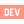

<h3 align="center">Hello I'm Kilian</h3>

&#8287;&#8287;&#8287;&#8287;&#8287;

&#8287;&#8287;&#8287;&#8287;&#8287;

&#8287;&#8287;&#8287;&#8287;&#8287;

<h2>Web development</h2>

&#8287;

&#8287;

&#8287;

 

&#8287;

&#8287;

&#8287;

<h2>Game development</h2>

&#8287;

&#8287;

 

&#8287;

&#8287;

